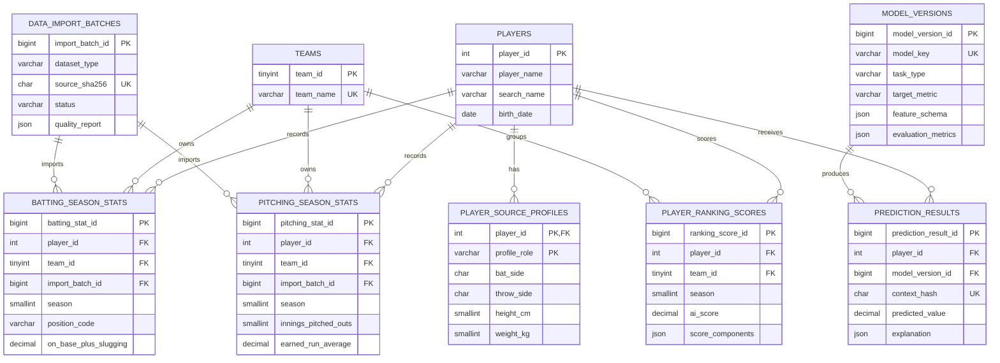

# 기록의 다음 DB 설계

## 1. 범위와 전제

이 설계는 MySQL 8.0(InnoDB, `utf8mb4`)을 대상으로 한다. 원본 CSV의 시즌 기록,
모델 버전과 반복 조회가 필요한 예측/랭킹 결과를 저장한다. 유사 선수 추천,
성장곡선과 선수 비교는 저장된 시즌 기록에서 계산하므로 별도 원본성 테이블을 만들지
않는다.

실행 가능한 기준 DDL은
[`database/migrations/001_initial_schema.sql`](../database/migrations/001_initial_schema.sql)에
있다. 4단계 Backend 구축에서 이를 SQLAlchemy 모델과 Alembic revision으로 옮기고
실제 MySQL에 적용한다.

## 2. ERD



## 3. 테이블별 책임

### `players`

두 CSV에서 충돌하지 않는 선수 ID, 이름, 생년월일만 보관한다. `player_id`는 원본 KBO
ID를 그대로 PK로 사용한다. 동명이인이 많으므로 이름은 식별자가 아니다.

`search_name`은 이름의 공백을 제거하고 소문자화한 검색 전용 값이다. 일반 B-tree
인덱스로 exact/prefix 검색을 지원한다. 초기 제품은 `김도%` 같은 prefix 검색을
기본으로 하고, 임의 중간 문자열 검색이 실제로 필요해지면 MySQL ngram FULLTEXT나
별도 검색엔진을 ADR 검토 후 추가한다.

### `player_source_profiles`

`player_id + profile_role`이 PK다. 실제 데이터에서 타자/투수 CSV 사이의 투타 정보
충돌 2명과 체중 충돌 1명이 확인됐기 때문에 어느 출처를 임의 우선하지 않는다.
화면에서는 선택한 역할에 맞는 프로필을 사용한다.

포지션은 타자 378명에서 시즌별로 변하므로 이 테이블이 아니라
`batting_season_stats.position_code`에 저장한다. 투수 역할은 투수 시즌 기록의
존재로 판별한다.

### `teams`

원본의 23개 팀명을 정규화해 FK로 참조한다. 과거 팀명은 원본 사실이므로 현 구단명과
임의 병합하지 않는다. 구단 계보 분석 요구가 생기면 `franchises`와
`team_franchise_periods`를 추가할 수 있다.

### 시즌 기록 테이블

타자와 투수는 지표 의미와 NULL 규칙이 다르므로 별도 테이블로 분리한다.

- surrogate PK를 사용해 API 식별과 ORM 처리를 단순화한다.
- 자연키 `player_id + season + team_id`에는 UNIQUE 제약을 둔다.
- 원본 batch FK를 통해 각 행의 적재 출처를 추적한다.
- 계산용 이닝은 정수 아웃 수로만 저장한다. 화면 표기는 `outs / 3`으로 복원한다.
- 나이는 중복 저장하지 않고 `season - YEAR(birth_date)`로 계산한다.
- 0타수 비율, 0이닝 ERA, 무승패 승률은 NULL을 허용한다.

### `team_rosters`

KBO 공식 선수 등록 현황의 날짜별 1군 로스터 snapshot이다. 자연키
`season + as_of_date + team_id + player_id`에 UNIQUE 제약을 두고, 같은 날짜를 다시
적재할 때는 검증 완료 후 해당 snapshot만 transaction으로 교체한다. 등번호의 `00`을
보존하기 위해 문자열로 저장하며 포지션은 `P`, `C`, `IF`, `OF`로 정규화한다.

`(season, team_id, as_of_date)` 인덱스로 구단별 최신 기준일과 명단을 조회한다. 선수 및
팀 FK는 기존 식별자를 재사용하며, 로스터가 있다고 해서 경기 출전 기록이 있다고
가정하지 않는다.

### `team_standings`, `game_day_snapshots`

`team_standings`는 구단별 날짜 단위 순위·승패 스냅샷을 저장한다.
`game_day_snapshots`는 홈 화면의 경기 일정·결과 응답을 `season + game_date` 자연키와
JSON payload로 저장한다. 후자는 수집기와 화면 API를 분리해 KBO 장애가 사용자 요청으로
전파되지 않게 하며, 재수집 시 같은 날짜 레코드를 갱신한다.

### `data_import_batches`

원본 파일명, SHA-256, 행 수, 성공 상태와 품질 결과를 남긴다. 동일 dataset/hash의
중복 적재를 UNIQUE 제약으로 차단한다. 적재 실패 시 batch 상태를 `FAILED`로 남기고
시즌 기록 transaction은 rollback한다.

### ML 관련 테이블

- `model_versions`: artifact 위치, feature schema, 학습 기간과 평가지표를 JSON으로
  기록한다. 생성 컬럼 `active_target_key`의 UNIQUE 제약으로 task/target별 활성 모델을
  하나만 허용한다. 모델 파일 자체는 DB BLOB으로 저장하지 않는다.
- `prediction_results`: 계산 비용이 높은 예측과 SHAP 결과의 선택적 캐시다. 입력을
  정규화한 SHA-256 `context_hash`로 같은 요청의 중복 계산을 막는다.
- `player_ranking_scores`: 점수 공식 버전별 materialized 결과다. 순위 숫자는 필터에
  따라 달라지므로 저장하지 않고 SQL window function으로 계산한다.

유사 선수 추천 결과는 입력 선수, 비교 시즌, feature set과 필터에 따라 달라지므로
초기 버전에서는 저장하지 않는다. 성능 문제가 확인된 후 TTL 캐시를 도입한다.

## 4. 타입과 정밀도 결정

| 대상 | MySQL 타입 | 근거 |
|---|---|---|
| 선수 ID | `INT UNSIGNED` | 원본 숫자 ID, 실제 최댓값이 범위 내 |
| 시즌 | `SMALLINT UNSIGNED` | 1982~2026, 확장 상한 2200 |
| 누적 기록 | `SMALLINT UNSIGNED` | 실제 최댓값 1,712 이하, 음수 불가 |
| 투구 아웃 | `SMALLINT UNSIGNED` | 분수/부동소수 오차 방지 |
| AVG/OBP/SLG/OPS | `DECIMAL(5,3)` | 원본 3자리 정밀도, OPS 최대 5.000 |
| ERA | `DECIMAL(7,3)` | 소표본 극단값 162.000 수용 |
| WPCT | `DECIMAL(4,3)` | 0.000~1.000 |
| 예측값 | `DECIMAL(14,5)` | 다양한 target과 예측 정밀도 수용 |
| 설명/지표 | `JSON` | target/모델별 가변 구조와 버전 보존 |

비율값에 `FLOAT` 대신 `DECIMAL`을 사용해 API 표시 및 공식 재검증 시 이진 부동소수
오차를 줄인다. 모델 학습 시 Pandas/NumPy float로 변환한다.

## 5. 인덱스 설계

| 인덱스 | 지원하는 대표 조회 |
|---|---|
| `players(search_name)` | 선수명 exact/prefix 검색 |
| 시즌 기록 UNIQUE `(player_id, season, team_id)` | 선수 상세 시즌 오름차순 조회 |
| 타격 `(season, team_id)` | 시즌/팀 타자 목록과 조건 검색 |
| 타격 `(season, OPS DESC)` | 시즌 OPS 후보 정렬 |
| 투구 `(season, team_id)` | 시즌/팀 투수 목록 |
| 투구 `(season, ERA)` | 최소 이닝 적용 전 ERA 후보 정렬 |
| 모델 `(task_type, target_metric, is_active)` | 활성 추론 모델 로딩 |
| 랭킹 board 인덱스 | 시즌/팀/역할별 AI Score 정렬 |

`Age <= 25`는 시즌당 후보 행이 작고 생년월일 조인 계산이므로 초기에는 별도 중복
컬럼/인덱스를 만들지 않는다. 운영 query plan에서 병목이 확인된 경우에만 materialized
age를 검토한다.

## 6. 삭제 및 갱신 정책

- 선수 삭제는 시즌 기록이 있으면 `RESTRICT`한다.
- 잘못 적재된 import batch도 참조 행이 있으면 삭제하지 않는다.
- 예측 캐시와 랭킹 결과는 선수 삭제 시 `CASCADE` 가능하지만, 실제 선수 삭제는
  관리자 정정 작업으로 제한한다.
- 선수 ID, 팀 ID와 모델 버전 FK는 `ON UPDATE RESTRICT`로 불변 식별자로 취급한다.
- 원본 이력 정정은 행 삭제보다 새 batch 적재와 audit log를 우선한다.

## 7. CSV 적재 순서

각 파일은 별도 transaction으로 다음 순서를 따른다.

```text
1. 파일 SHA-256 및 스키마/행 수 검증
2. data_import_batches에 RUNNING batch 생성
3. teams seed와 CSV 팀 집합이 동일한지 검증
4. 타자+투수의 player_id/name/birth_date 신원 병합
5. players upsert (ID가 같고 이름/생년이 다르면 즉시 실패)
6. player_source_profiles를 역할별 upsert
7. 시즌 기록 bulk insert/upsert
8. source/imported 행 수와 DB 자연키 수 검증
9. batch를 SUCCEEDED로 변경 후 commit
```

동일 해시는 재적재하지 않는다. 다른 해시의 전체 snapshot이 들어오면 임시 staging
테이블과 비교한 후 upsert하며, 사라진 행은 자동 삭제하지 않고 품질 보고서에서 먼저
검토한다.

## 8. 주요 조회 흐름

```text
선수 검색
players(search_name) → 역할별 profile 존재 여부

선수 상세
players → batting/pitching season stats → teams

조건 추천
season/team/최소 PA·IP 필터 → 비율·나이 조건 → score/similarity service

선수 비교와 성장곡선
두 player_id의 시즌 기록 조회 → Service에서 정규화·성장률 계산

예측
시즌 기록 → feature pipeline → 활성 model_versions → prediction cache
```

## 9. 검증 결과

[`scripts/validate_db_design.py`](../scripts/validate_db_design.py)로 실제 정제 데이터에
DDL의 범위, 길이, 자연키와 도메인 제약을 적용했다.

| 예상 초기 테이블 | 행 수 |
|---|---:|
| `players` | 3,506 |
| `player_source_profiles` | 3,532 |
| `teams` | 23 |
| `batting_season_stats` | 9,703 |
| `pitching_season_stats` | 7,625 |

데이터 기반 검증은 모두 통과했다. 로컬 MySQL Community Server 8.0.43의
`kbo_stats` DB에 Alembic `0001_core`을 실제 적용했다. 이어서 원본 해시 기반 batch로
타자 9,703행과 투수 7,625행을 적재했으며 선수/프로필/팀 cardinality와 실제 API 조회를
검증했다. 실행 결과는 [`reports/backend-runtime-validation.json`](../reports/backend-runtime-validation.json)에
기록한다.

## 10. 후속 확장 지점

- 구단 계보: `franchises`, `team_franchise_periods`
- 선수명 별칭/영문명: `player_aliases`
- 다중 포지션/출장 수 데이터가 추가될 경우: `player_season_positions`
- 인증 도입 시 사용자 즐겨찾기: `users`, `favorite_players`
- 모델 artifact가 커질 경우: object storage URI 및 checksum 필드 추가
